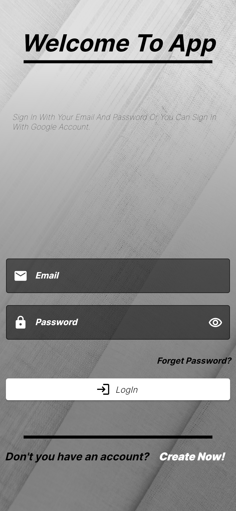
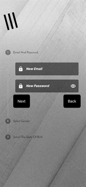

# shopping_app_with_flutter

In This Project, I Have Done The Shopping Application. When I Was Doing This Project, I Had More Based To IOS Platform. For Instance, I Have Used The Cupertino Picker,Cupertino Button etc. But Of course, We Can Use This App For Android Platform. There Are Some Tools At The Below Which I Have Used. Briefly, These Tools Are:
-Riverpod
-Firebase
-Dio etc.
## Photos

